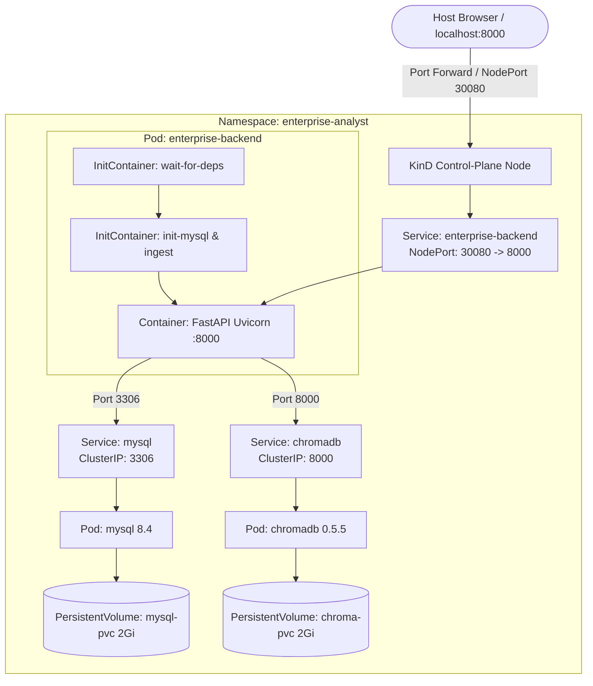

# ☸️ Local Kubernetes Deployment Guide (KinD)
### MCP Enterprise Data Analyst on KinD (Kubernetes in Docker)

This guide provides end-to-end instructions for deploying the **MCP Enterprise Data Analyst** stack on a local Kubernetes cluster using **KinD (Kubernetes in Docker)**.

---

## 📋 Architecture Overview

The local Kubernetes deployment runs 3 interconnected services inside an isolated namespace (`enterprise-analyst`):



---

## 🛠️ Prerequisites

Before you start, make sure you have the following installed on your machine:

1. **Docker Desktop** (or Docker Engine on Linux) — Must be running.
2. **KinD CLI**:
   - **Windows (Chocolatey / Scoop / Winget)**:
     ```powershell
     winget install Kubernetes.kind
     # or: choco install kind
     ```
   - **macOS (Homebrew)**:
     ```bash
     brew install kind
     ```
   - **Linux**:
     ```bash
     [ $(uname -m) = x86_64 ] && curl -Lo ./kind https://kind.sigs.k8s.io/dl/v0.24.0/kind-linux-amd64
     chmod +x ./kind
     sudo mv ./kind /usr/local/bin/kind
     ```
3. **kubectl CLI**:
   - **Windows**: `winget install Kubernetes.kubectl`
   - **macOS**: `brew install kubectl`
   - **Linux**: `sudo apt install -y kubectl` (or official binary)

Verify installations:
```bash
docker --version
kind --version
kubectl version --client
```

---

## 🚀 Step-by-Step Deployment

### Step 1: Create the KinD Cluster with Port Mapping

The repository includes a custom KinD configuration ([`k8s/kind-config.yaml`](k8s/kind-config.yaml)) that maps **NodePort 30080** directly to your host's **localhost:8000**:

```bash
kind create cluster --config k8s/kind-config.yaml
```

*Output:*
```
Creating cluster "enterprise-analyst-cluster" ...
 ✓ Ensuring node image (kindest/node:v1.31.0) 🖼
 ✓ Preparing nodes 📦
 ✓ Writing configuration 📜
 ✓ Starting control-plane 🕹️
 ✓ Installing CNI 🔌
 ✓ Installing StorageClass 💾
Set kubectl context to "kind-enterprise-analyst-cluster"
```

Verify your cluster node is Ready:
```bash
kubectl get nodes
```

---

### Step 2: Build the Backend Docker Image Locally

Build the container image on your machine:

```bash
docker build -t mcp-enterprise-backend:latest .
```

---

### Step 3: Load the Local Image into the KinD Cluster

Because KinD runs inside Docker containers, you don't need to push your image to Docker Hub. You can load it directly into KinD's internal node runtime:

```bash
kind load docker-image mcp-enterprise-backend:latest --name enterprise-analyst-cluster
```

*(This copies the local image directly into the KinD control-plane container in seconds).*

---

### Step 4: Configure Secrets (`k8s/01-secret.yaml`)

Open [`k8s/01-secret.yaml`](k8s/01-secret.yaml) in your editor and enter your Groq API key:

```yaml
apiVersion: v1
kind: Secret
metadata:
  name: analyst-secrets
  namespace: enterprise-analyst
type: Opaque
stringData:
  GROQ_API_KEY: "gsk_your_actual_groq_api_key_here"  # <-- Paste your Groq API key
  MYSQL_ROOT_PASSWORD: "root"
  MYSQL_PASSWORD: "root"
```

> **Alternatively**, update the secret directly via command line without editing files:
> ```bash
> kubectl create namespace enterprise-analyst --dry-run=client -o yaml | kubectl apply -f -
> kubectl create secret generic analyst-secrets \
>   --namespace enterprise-analyst \
>   --from-literal=GROQ_API_KEY="gsk_your_actual_groq_api_key" \
>   --from-literal=MYSQL_ROOT_PASSWORD="root" \
>   --from-literal=MYSQL_PASSWORD="root" \
>   --dry-run=client -o yaml | kubectl apply -f -
> ```

---

### Step 5: Deploy All Kubernetes Manifests

Apply the entire configuration using Kustomize:

```bash
kubectl apply -k k8s/
```

*Output:*
```
namespace/enterprise-analyst unchanged
configmap/analyst-config created
secret/analyst-secrets created
service/chromadb created
service/enterprise-backend created
service/mysql created
persistentvolumeclaim/chroma-pvc created
persistentvolumeclaim/mysql-pvc created
deployment.apps/chromadb created
deployment.apps/enterprise-backend created
deployment.apps/mysql created
```

---

### Step 6: Monitor Deployment & Pod Readiness

Watch the pods as they initialize:

```bash
kubectl get pods -n enterprise-analyst -w
```

You will see:
1. `mysql-...` and `chromadb-...` start and become `1/1 Running` and `Healthy`.
2. `enterprise-backend-...` runs its **InitContainers**:
   - `wait-for-dependencies`: Waits until MySQL (3306) and ChromaDB (8000) are reachable.
   - `init-mysql-and-chroma`: Automatically executes schema creation, loads 5,300+ order records into MySQL, and computes vector embeddings for policies into ChromaDB.
3. `enterprise-backend` becomes **`1/1 Running`**.

---

### Step 7: Access the Application

Because of the `extraPortMappings` configured in `k8s/kind-config.yaml`:

👉 **Open your browser at:**  
**`http://localhost:8000`**

You can also test the diagnostic healthcheck:
```bash
curl http://localhost:8000/health
```

Expected response:
```json
{
  "status": "healthy",
  "components": {
    "fastapi": "healthy",
    "mysql": "healthy",
    "chromadb": "healthy",
    "llm_engine": "groq (openai/gpt-oss-120b)"
  }
}
```

> **Alternative Port Forward**: If you ever run without the custom KinD config:
> ```bash
> kubectl port-forward svc/enterprise-backend 8000:8000 -n enterprise-analyst
> ```

---

## 🔍 Useful Kubernetes Commands & Debugging

### View Application Logs:
```bash
# View backend logs in real-time
kubectl logs -f deployment/enterprise-backend -c backend -n enterprise-analyst

# View MySQL logs
kubectl logs -f deployment/mysql -n enterprise-analyst

# View ChromaDB logs
kubectl logs -f deployment/chromadb -n enterprise-analyst
```

### Inspect InitContainer Seeding Logs:
```bash
kubectl logs deployment/enterprise-backend -c init-mysql-and-chroma -n enterprise-analyst
```

### Run an Interactive Shell inside the Backend Pod:
```bash
kubectl exec -it deployment/enterprise-backend -c backend -n enterprise-analyst -- /bin/bash
```

### Re-ingest Documents or Force Re-indexing:
```bash
kubectl exec deployment/enterprise-backend -c backend -n enterprise-analyst -- \
  python -c "from backend.chroma import chroma_manager; chroma_manager.ingest_documents(force=True)"
```

### Check Persistent Storage Volumes:
```bash
kubectl get pvc -n enterprise-analyst
kubectl get pv
```

---

## 🧹 Teardown & Cleanup

When you are finished testing, you can delete the workloads or tear down the entire KinD cluster in one command:

### Option 1: Delete only the application workloads (keep cluster running)
```bash
kubectl delete -k k8s/
```

### Option 2: Delete the entire KinD cluster (frees all Docker resources)
```bash
kind delete cluster --name enterprise-analyst-cluster
```
