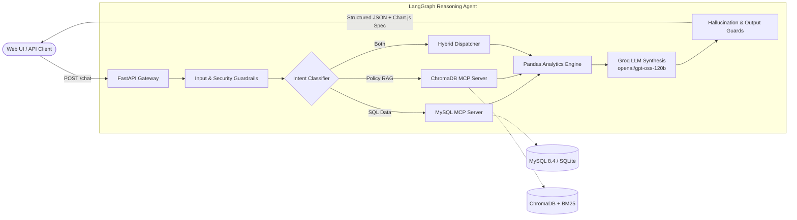

# 🚀 MCP Enterprise Data Analyst
### Developer Documentation & Technical Reference

[](https://www.python.org/)
[](https://fastapi.tiangolo.com)
[](https://langchain-ai.github.io/langgraph/)
[](https://www.trychroma.com)
[](https://www.mysql.com)
[](https://www.docker.com)
[](k8s/)
[](tests/)

An enterprise conversational analytics engine that converts natural language business inquiries into deterministic SQL aggregates and audited policy retrievals. Mediates all access through strictly typed **Model Context Protocol (MCP)** tools, **Hybrid RAG** (BM25 + Semantic + Reranking), and an **11-Layer AI Guardrail pipeline**.

---

## ⚡ Quick Start

### 1. Local Python Development (Zero-Config)
The backend includes an **automatic SQLite fallback engine** (`data/enterprise_analytics_fallback.db`), so you can run and test offline without installing MySQL:

```bash
# Clone repository
git clone https://github.com/bittush8789/mcp-enterprise-data-analyst.git
cd mcp-enterprise-data-analyst

# Setup virtual environment
python -m venv venv
# Windows (PowerShell): .\venv\Scripts\Activate.ps1 | Linux/Mac: source venv/bin/activate
pip install -r requirements.txt

# Configure environment
cp .env.example .env
# Edit .env and set your GROQ_API_KEY (from https://console.groq.com)

# Initialize schema & test records
python -m backend.seed_data
python -m backend.init_mysql

# Start dev server with hot reload
uvicorn backend.main:app --host 0.0.0.0 --port 8000 --reload
```
- **Web UI**: [http://localhost:8000](http://localhost:8000)
- **Interactive Swagger**: [http://localhost:8000/docs](http://localhost:8000/docs)

---

### 2. Docker Compose (Full Stack)
Spins up FastAPI Backend, MySQL 8.4, and ChromaDB:

```bash
cp .env.example .env    # Configure GROQ_API_KEY
docker compose up --build
```

---

## 🏗️ Architecture Blueprint



---

## 📁 Codebase Layout

```
mcp-enterprise-data-analyst/
├── backend/
│   ├── main.py              # FastAPI endpoints, CORS, static frontend serving
│   ├── config.py            # Centralized Pydantic Settings
│   ├── agent.py             # LangGraph 9-node state reasoning graph
│   ├── prompts.py           # Master System Prompt & classification prompts
│   ├── guardrails.py        # 11-Layer AI Guardrails & regex security filters
│   ├── analytics.py         # Deterministic Pandas engine & Chart.js formatter
│   ├── mysql.py             # MySQL connection pool + SQLite auto-fallback
│   ├── chroma.py            # ChromaDB embeddings & chunk persistence
│   ├── rag.py               # Hybrid Search (Semantic + BM25Okapi + Fusion)
│   ├── reranker.py          # Cross-scoring term density reranker
│   ├── seed_data.py         # Mock data generator (550 customers, 5.3k orders)
│   ├── init_mysql.py        # DDL & seed data loader
│   ├── mcp/
│   │   ├── mysql_server.py  # Parameterized business SQL tools (No raw SQL!)
│   │   └── chroma_server.py # Semantic & policy document retrieval tools
│   └── models/
│       └── schemas.py       # Pydantic request, response, and evidence models
├── frontend/
│   ├── index.html           # Modern executive analytics workspace
│   ├── style.css            # Dark executive theme & responsive layout
│   └── app.js               # Reactive chat client & Chart.js renderer
├── data/
│   ├── schema.sql           # MySQL DDL with order_revenue analytical view
│   ├── seed.sql             # Relational seed records
│   └── documents/           # Enterprise policy texts (refund, warranty, SOPs)
├── k8s/                     # Kubernetes manifests & KinD cluster configuration
├── tests/                   # Pytest automated test suites
├── DEPLOYMENT_EC2.md        # AWS EC2 deployment documentation
├── DEPLOYMENT_KIND.md       # Local Kubernetes (KinD) deployment documentation
├── docker-compose.yml       # 3-tier container stack
├── requirements.txt         # Pinned Python package dependencies
└── Dockerfile               # Container build configuration
```

---

## ⚙️ Environment Configuration

Set these variables in your `.env` file:

| Variable | Default | Required | Purpose |
|---|---|---|---|
| `GROQ_API_KEY` | `""` | **Yes** | Groq Cloud API key for high-speed inference. |
| `GROQ_MODEL` | `openai/gpt-oss-120b` | No | Model name (e.g. `llama-3.3-70b-versatile`). |
| `MYSQL_HOST` | `127.0.0.1` | No | Host address of MySQL server (auto-falls back to SQLite). |
| `MYSQL_PORT` | `3306` | No | MySQL port. |
| `MYSQL_DATABASE`| `enterprise_analytics` | No | Relational database name. |
| `MYSQL_USER` | `root` | No | Database username. |
| `MYSQL_PASSWORD`| `root` | No | Database password. |
| `CHROMA_PERSIST_DIR` | `./data/chroma_db` | No | Local directory for persistent Chroma vector store. |
| `SEMANTIC_WEIGHT` | `0.6` | No | Weight for dense vector search (0.0 to 1.0). |
| `KEYWORD_WEIGHT`  | `0.4` | No | Weight for sparse BM25 lexical search. |
| `TOP_K` | `5` | No | Number of retrieved document chunks for synthesis. |
| `MAX_ROWS` | `1000` | No | Maximum rows returned per analytical SQL query. |
| `QUERY_TIMEOUT` | `10` | No | SQL query execution timeout in seconds. |

---

## 🛠️ Developer Recipes

### 1. Add a New MySQL MCP Tool
Add your method in [`backend/mcp/mysql_server.py`](backend/mcp/mysql_server.py):

```python
def get_order_status_distribution(self) -> MCPToolResult:
    """Returns order count and total value grouped by status."""
    query = """
        SELECT 
            status, 
            COUNT(order_id) AS total_orders, 
            ROUND(SUM(total_amount), 2) AS total_value
        FROM orders
        GROUP BY status;
    """
    raw_data = self.mysql.execute_query(query)
    data = [_serialize_row(r) for r in raw_data]
    return MCPToolResult(source="mysql", metric="order_distribution", data=data, row_count=len(data))
```
*Rule: Never execute raw SQL strings passed from LLM prompts. Always use pre-approved, parameterized queries.*

---

### 2. Add New Policy Documents & Re-index
1. Save your text file in [`data/documents/`](data/documents/) (e.g. `data/documents/security_policy.txt`).
2. Force re-index ChromaDB and BM25:
```bash
python -c "from backend.chroma import chroma_manager; chroma_manager.ingest_documents(force=True)"
```

---

### 3. Add Custom AI Guardrail Rules
In [`backend/guardrails.py`](backend/guardrails.py), add regex patterns or logic inside `validate_input()`:

```python
BLOCKED_PATTERNS = [r"\bINTERNAL_SECRET_PROJECT\b"]

def validate_custom_term(self, text: str) -> Optional[str]:
    for p in self.BLOCKED_PATTERNS:
        if re.search(p, text, re.IGNORECASE):
            return "RESTRICTED_TERM_DETECTED"
    return None
```

---

## 🧪 Testing & Quality Assurance

Run the test suite with `pytest`:

```bash
# Run all tests
pytest tests/ -v

# Run targeted test suites:
pytest tests/test_agent.py -v       # 14 business queries + prompt injections + causal refusal
pytest tests/test_mcp.py -v         # MCP tool validation & parameter bounds
pytest tests/test_guardrails.py -v  # 11 guardrail layers & PII scrubbing
pytest tests/test_rag.py -v         # BM25 + Semantic fusion search tests
```

---

## 🔌 API Cheat Sheet

### `POST /chat`
```bash
curl -X POST "http://localhost:8000/chat" \
     -H "Content-Type: application/json" \
     -d '{"message": "Show revenue by region for the last 6 months."}'
```
**Response Format:**
```json
{
  "answer": "Here is the revenue breakdown...",
  "sources": [{ "type": "mysql", "name": "order_revenue" }],
  "data": [{ "region_name": "North", "total_revenue": 45952900.0 }],
  "visualization": {
    "type": "bar",
    "title": "Revenue by Geographic Region",
    "x": ["North", "West", "East", "South", "Central"],
    "y": [45952900.0, 36081200.0, 31589000.0, 29510700.0, 19742400.0]
  },
  "guardrail_flags": []
}
```

### `GET /health`
```bash
curl http://localhost:8000/health
```

### `GET /sources`
```bash
curl http://localhost:8000/sources
```

---

## 🚢 Production Deployment & System Architecture

- **📐 System Architecture & Low-Level Design**: Complete architectural specs in [`system-design.md`](system-design.md).
- **AWS EC2 (Docker + Nginx + SSL)**: Detailed production VM guide in [`DEPLOYMENT_EC2.md`](DEPLOYMENT_EC2.md).
- **Kubernetes (KinD Cluster & Manifests)**: Step-by-step local cluster setup in [`DEPLOYMENT_KIND.md`](DEPLOYMENT_KIND.md) and [`k8s/`](k8s/).

---

## 📄 License
This project is licensed under the [MIT License](LICENSE).
