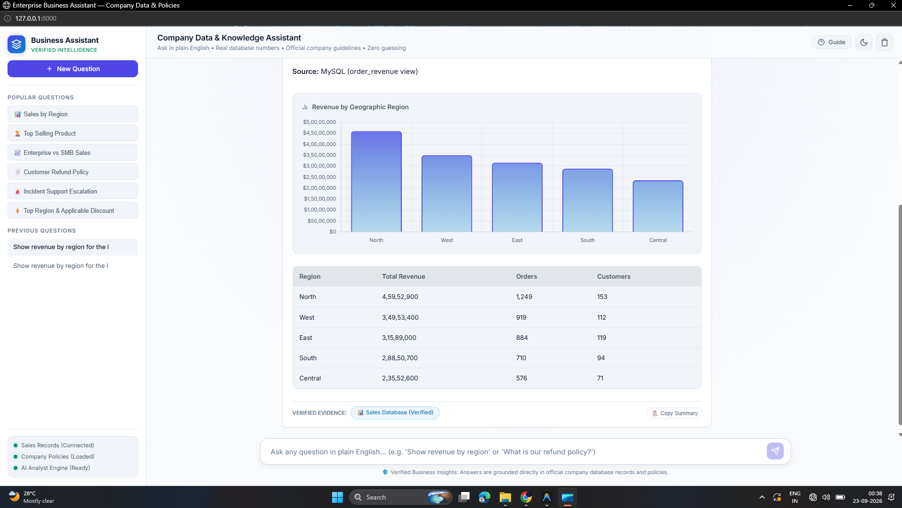
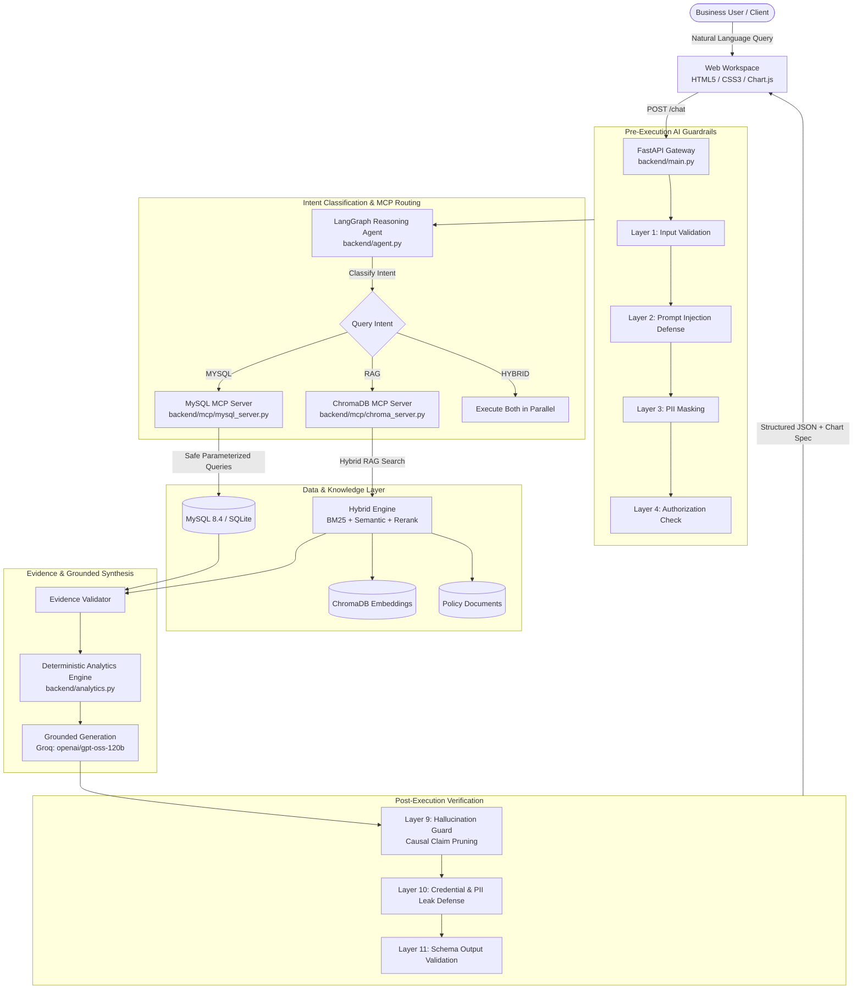
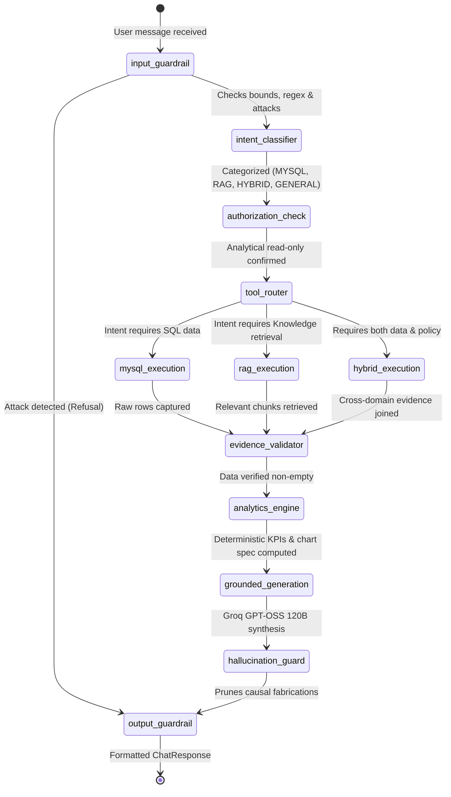

# 🏢 MCP Enterprise Data Analyst
### Autonomous Enterprise Business Intelligence with Hybrid RAG, MCP Tools & 11-Layer AI Guardrails

[](https://www.python.org/)
[](https://fastapi.tiangolo.com)
[](https://langchain-ai.github.io/langgraph/)
[-F55036.svg)](https://groq.com)
[](https://www.trychroma.com)
[](https://www.mysql.com)
[](https://www.docker.com)
[](tests/)
[](LICENSE)

An enterprise-grade, conversational intelligence system that enables non-technical decision-makers to query **relational transactional databases (MySQL)** and **unstructured corporate policies (ChromaDB)** in plain English. 

Unlike traditional chatbots that hallucinate numbers or execute dangerous arbitrary SQL queries, this system mediates every operation through strictly parameterized **Model Context Protocol (MCP)** tools, computes metrics via **deterministic Pandas algorithms**, and protects corporate data with an **11-Layer AI Guardrail pipeline**.

---

## 📸 Executive Dashboard Preview



*Interactive executive analytics interface: Natural language query, automatic Chart.js visualization, verified data table, source citation pills, and verified evidence audit trail.*

---

## ⚡ 2-Minute Quick Start

Choose your preferred way to run the stack:

### Option A: Docker Compose (Recommended — Zero Host Dependencies)

Spin up the complete containerized stack (FastAPI Backend, MySQL 8.4, ChromaDB v0.5.5) in one command:

```bash
# 1. Clone & enter project directory
git clone <repo-url>
cd "MCP Enterprise Data Analyst"

# 2. Configure environment
cp .env.example .env
# Edit .env and paste your GROQ_API_KEY

# 3. Launch stack
docker compose up --build
```
> **That's it!** Open [http://localhost:8000](http://localhost:8000) in your browser.

---

### Option B: Local Development (Python Virtual Environment)

Designed with **instant zero-friction fallback**: If MySQL is not running on your host machine, the engine **automatically switches to a local SQLite fallback database**, so you can start developing immediately!

```bash
# 1. Create and activate a virtual environment
python -m venv venv

# Windows (PowerShell):
.\venv\Scripts\Activate.ps1
# Linux/macOS:
source venv/bin/activate

# 2. Install dependencies
pip install -r requirements.txt

# 3. Set up environment variables
cp .env.example .env    # On Windows: copy .env.example .env
# Edit .env to add your GROQ_API_KEY (from https://console.groq.com)

# 4. Generate mock enterprise data & initialize schema
python -m backend.seed_data
python -m backend.init_mysql

# 5. Start the FastAPI development server with hot-reload
uvicorn backend.main:app --host 0.0.0.0 --port 8000 --reload
```

Visit [http://localhost:8000](http://localhost:8000) for the UI or [http://localhost:8000/docs](http://localhost:8000/docs) for the interactive OpenAPI/Swagger docs.

---

## 📑 Table of Contents

- [Key Capabilities](#-key-capabilities)
- [System Architecture](#-system-architecture)
- [LangGraph Reasoning Workflow](#-langgraph-reasoning-workflow)
- [Hybrid RAG Pipeline](#-hybrid-rag-pipeline)
- [11-Layer AI Guardrails](#-11-layer-ai-guardrails)
- [Codebase Map](#-codebase-map)
- [Developer Recipes & How-To Guides](#-developer-recipes--how-to-guides)
  - [Recipe 1: Add a New MySQL MCP Tool](#recipe-1-add-a-new-mysql-mcp-tool)
  - [Recipe 2: Add & Index New Knowledge Documents](#recipe-2-add--index-new-knowledge-documents)
  - [Recipe 3: Add a Custom Guardrail Rule](#recipe-3-add-a-custom-guardrail-rule)
  - [Recipe 4: Add or Modify Chart Visualizations](#recipe-4-add-or-modify-chart-visualizations)
  - [Recipe 5: Swap or Configure the LLM Engine](#recipe-5-swap-or-configure-the-llm-engine)
- [API Reference & Curl Examples](#-api-reference--curl-examples)
- [Database Schema & SQL Safety](#-database-schema--sql-safety)
- [Environment Configuration](#-environment-configuration)
- [Automated Testing & QA](#-automated-testing--qa)
- [Troubleshooting & FAQs](#-troubleshooting--faqs)

---

## 💡 Key Capabilities

| Capability | How It Works | Developer Value |
|---|---|---|
| **Zero Raw SQL Injection** | Never generates or runs raw SQL strings from LLM text. Uses strictly typed MCP tool functions. | Eliminates catastrophic database mutations (`DROP`, `DELETE`) and SQLi attacks. |
| **Deterministic Calculations** | All sums, averages, and group metrics are computed with Pandas / SQL aggregates, not LLM math. | 100% mathematical accuracy on financial numbers. |
| **Hybrid RAG Retrieval** | Combines vector semantic search (ChromaDB) with lexical keyword matching (Rank-BM25) and cross-reranking. | Finds exact numbers (`$10,000`, `99.99%`, `Severity 1`) and conceptual policies with high recall. |
| **Hallucination Prevention** | Automatically refuses causal claims (*"Why did sales drop?"*) when records lack underlying explanatory variables. | Prevents fictitious business justifications. |
| **Dual Engine Database** | Native MySQL 8.4 pool with automatic graceful fallback to embedded SQLite. | Developers can run and test offline with zero database configuration. |
| **Reactive Visualizations** | Analytics engine automatically formats data into Chart.js specs (Bar, Line, Pie). | Generates interactive visual charts without manual frontend charting code. |

---

## 🏛️ System Architecture



---

## 🔄 LangGraph Reasoning Workflow

The agent orchestrates queries using a deterministic **LangGraph StateGraph** (`backend/agent.py`):



---

## 🔍 Hybrid RAG Pipeline

For qualitative business questions (policies, SLAs, SOPs), standard vector search often misses exact numerical figures or keyword codes. Our **Hybrid RAG** engine combines dense semantic vectors with sparse BM25 scoring:

```
                User Query
                    │
         ┌──────────┴──────────┐
         ▼                     ▼
  Semantic Search         Rank-BM25
 (ChromaDB Cosine)     (Exact Lexical)
         │                     │
         └──────────┬──────────┘
                    ▼
           Score Normalization
                    ▼
          Weighted Rank Fusion
      score = 0.6*Dense + 0.4*BM25
                    ▼
           Cross-Term Reranker
    (Exact query term density & proximity)
                    ▼
           Top-K RAG Evidence
```

---

## 🛡️ 11-Layer AI Guardrails

Security is enforced at every boundary:

```
[Layer 1] Input Length & Sanitization  ──> Caps query at 2000 chars, strips malicious null bytes
[Layer 2] Prompt Injection Defense     ──> Intercepts jailbreaks ("Ignore previous rules", roleplays)
[Layer 3] PII Masking                  ──> Redacts SSNs, credit cards, emails, phone numbers
[Layer 4] Intent Authorization         ──> Ensures query is purely analytical and read-only
[Layer 5] Tool Permission Whitelist    ──> Restricts LLM to registered MCP tools only
[Layer 6] SQL Safety Enforcement       ──> Blocks DROP, DELETE, INSERT, UPDATE, ALTER, TRUNCATE
[Layer 7] RAG Document Sanitization    ──> Defangs indirect prompt injections hidden in files
[Layer 8] Evidence Cross-Validation    ──> Ensures claims have corresponding database/document proof
[Layer 9] Hallucination Causal Guard   ──> Refuses speculative causal claims lacking data
[Layer 10] Output Credential Redaction ──> Scans outgoing responses for leaked keys or passwords
[Layer 11] Schema & Row-Limit Guard    ──> Limits queries to MAX_ROWS (1000) and 10s execution timeout
```

> **The Causal Refusal Rule**: If an executive asks *"Why did Central region revenue drop last quarter?"* and the transactional database only has order values without explanatory surveys or notes, the system automatically refuses:  
> *`"I can verify the revenue figures, but the available enterprise data does not contain sufficient evidence to determine why Central region revenue changed."`*

---

## 📂 Codebase Map

```
MCP Enterprise Data Analyst/
│
├── backend/
│   ├── main.py              # FastAPI application, routing, CORS, and static file serving
│   ├── config.py            # Centralized Pydantic Settings (reads from .env)
│   ├── agent.py             # LangGraph state machine & multi-node reasoning graph
│   ├── prompts.py           # Master System Prompt, classification prompts, synthesis template
│   ├── guardrails.py        # 11-Layer AI Guardrail implementation & regex engines
│   ├── analytics.py         # Deterministic Pandas engine & dynamic Chart.js generator
│   ├── mysql.py             # MySQL connection pool, query execution & SQLite auto-fallback
│   ├── chroma.py            # ChromaDB client, semantic chunking & vector persistence
│   ├── rag.py               # Hybrid search engine (BM25 + Semantic + Fusion)
│   ├── reranker.py          # Cross-scoring term density reranker
│   ├── seed_data.py         # Realistic enterprise data generator (550 customers, 5.3k orders)
│   ├── init_mysql.py        # Database schema initialization and seed runner
│   │
│   ├── mcp/
│   │   ├── __init__.py
│   │   ├── mysql_server.py  # Business SQL tools (get_revenue_by_region, monthly_revenue, etc.)
│   │   └── chroma_server.py # Document search tools (search_policy, search_sop, etc.)
│   │
│   └── models/
│       ├── __init__.py
│       └── schemas.py       # Pydantic schemas (ChatRequest, ChatResponse, MCPToolResult, etc.)
│
├── frontend/
│   ├── index.html           # Modern ChatGPT-style executive workspace
│   ├── style.css            # Dark executive theme, glassmorphism & responsive typography
│   └── app.js               # Reactive chat client, Markdown parsing & Chart.js renderer
│
├── data/
│   ├── schema.sql           # MySQL DDL with indexes and order_revenue analytical view
│   ├── seed.sql             # SQL seed records (5,300 orders across 5 regions)
│   └── documents/           # Enterprise knowledge repository (.txt files)
│       ├── refund_policy.txt
│       ├── discount_policy.txt
│       ├── warranty_policy.txt
│       └── escalation_sop.txt
│
├── tests/
│   ├── test_agent.py        # 14 benchmark business questions + injection + causal tests
│   ├── test_mcp.py          # MCP tool isolation, parameter bounds & schema tests
│   ├── test_rag.py          # BM25, semantic vector retrieval & reranker evaluation
│   └── test_guardrails.py   # Unit tests for all 11 AI guardrail layers
│
├── photo/
│   └── image.png            # Screenshot preview of the running application
│
├── .env.example             # Template for environment configuration
├── requirements.txt         # Pinned Python package dependencies
├── Dockerfile               # Multi-stage production container image
└── docker-compose.yml       # Production stack (backend, mysql, chromadb)
```

---

## 🛠️ Developer Recipes & How-To Guides

### Recipe 1: Add a New MySQL MCP Tool

To expose a new analytical view to the agent:

1. **Define the method in `backend/mcp/mysql_server.py`**:
```python
def get_customer_churn_risk(self, threshold_days: int = 90) -> MCPToolResult:
    """Identifies enterprise customers with no orders in the last N days."""
    query = """
        SELECT 
            customer_name, 
            customer_segment, 
            MAX(order_date) AS last_order_date,
            DATEDIFF(CURRENT_DATE, MAX(order_date)) AS days_inactive
        FROM order_revenue
        GROUP BY customer_id, customer_name, customer_segment
        HAVING days_inactive >= %s
        ORDER BY days_inactive DESC
        LIMIT 20;
    """
    raw_data = self.mysql.execute_query(query, (threshold_days,))
    data = [_serialize_row(r) for r in raw_data]
    return MCPToolResult(source="mysql", metric="churn_risk", data=data, row_count=len(data))
```

2. **Register the tool in `backend/agent.py`**:
   Add the tool dispatch logic under the `_tool_router_node` or query routing dictionary.

3. **Add unit test in `tests/test_mcp.py`**:
```python
def test_get_customer_churn_risk():
    res = mysql_mcp.get_customer_churn_risk(threshold_days=60)
    assert res.error is None
    assert isinstance(res.data, list)
```

---

### Recipe 2: Add & Index New Knowledge Documents

1. **Place your document in `data/documents/`** (e.g. `compliance_handbook.txt`):
```text
=== DOCUMENT: Compliance Handbook ===
VERSION: v2.0
SECTION: Data Privacy & Retention
Enterprise data is retained for 7 years. Customer deletion requests must be acknowledged within 48 hours.
```

2. **Re-index ChromaDB**:
Run this command from your terminal:
```bash
python -c "from backend.chroma import chroma_manager; chroma_manager.ingest_documents(force=True)"
```
The ingestion pipeline automatically computes embeddings, generates section metadata, and updates the BM25 index.

---

### Recipe 3: Add a Custom Guardrail Rule

1. Open `backend/guardrails.py`.
2. Add your pattern to the `AIGuardrails` class:
```python
CUSTOM_RESTRICTED_TERMS = [r"\bINTERNAL_CONFIDENTIAL_PROJECT_X\b", r"\bROOT_PASSWORD\b"]

def check_custom_rule(self, text: str) -> Optional[str]:
    for pattern in self.CUSTOM_RESTRICTED_TERMS:
        if re.search(pattern, text, re.IGNORECASE):
            return "RESTRICTED_TERM_DETECTED"
    return None
```
3. Call it inside `validate_input()` or `validate_output()`.

---

### Recipe 4: Add or Modify Chart Visualizations

Chart formatting is handled deterministically in `backend/analytics.py` (`AnalyticsEngine.create_chart_config`):

```python
# In backend/analytics.py:
def build_pie_chart(data: List[Dict[str, Any]], label_key: str, value_key: str, title: str):
    return {
        "type": "pie",
        "title": title,
        "x": [row[label_key] for row in data],
        "y": [float(row[value_key]) for row in data]
    }
```
The frontend (`frontend/app.js`) automatically renders this JSON spec into a dynamic Chart.js canvas.

---

### Recipe 5: Swap or Configure the LLM Engine

We use Groq API's blazing-fast inference with `openai/gpt-oss-120b`. To use another model (e.g., `llama-3.3-70b-versatile` or `mixtral-8x7b-32768`):

1. Edit `.env`:
```env
GROQ_MODEL=llama-3.3-70b-versatile
```
2. Or configure a custom base URL in `backend/config.py` if routing through LiteLLM or an internal vLLM cluster.

---

## 🔌 API Reference & Curl Examples

Interactive documentation is available at:
- **Swagger UI**: [http://localhost:8000/docs](http://localhost:8000/docs)
- **ReDoc**: [http://localhost:8000/redoc](http://localhost:8000/redoc)

### 1. Business Chat Endpoint: `POST /chat`

Submit a natural language business inquiry.

```bash
curl -X POST "http://localhost:8000/chat" \
     -H "Content-Type: application/json" \
     -d '{
       "message": "Show revenue by region for the last 6 months.",
       "conversation_id": "test-session-001"
     }'
```

#### Sample Response:
```json
{
  "answer": "Total completed revenue across all regions is $164,130,200.00. The **North** region leads with $45.95M, followed by the **West** region ($36.08M)...",
  "sources": [
    {
      "type": "mysql",
      "name": "order_revenue",
      "metadata": { "metric": "revenue_by_region", "rows": 5 }
    }
  ],
  "data": [
    { "region_name": "North", "total_revenue": 45952900.0, "order_count": 1249, "customer_count": 153 },
    { "region_name": "West", "total_revenue": 36081200.0, "order_count": 919, "customer_count": 112 },
    { "region_name": "East", "total_revenue": 31589000.0, "order_count": 884, "customer_count": 119 },
    { "region_name": "South", "total_revenue": 29510700.0, "order_count": 710, "customer_count": 94 },
    { "region_name": "Central", "total_revenue": 19742400.0, "order_count": 576, "customer_count": 71 }
  ],
  "visualization": {
    "type": "bar",
    "title": "Revenue by Geographic Region",
    "x": ["North", "West", "East", "South", "Central"],
    "y": [45952900.0, 36081200.0, 31589000.0, 29510700.0, 19742400.0]
  },
  "guardrail_flags": [],
  "conversation_id": "test-session-001"
}
```

---

### 2. Diagnostic Health Endpoint: `GET /health`

Verifies backend, MySQL, ChromaDB, and LLM readiness without leaking credentials.

```bash
curl -X GET "http://localhost:8000/health"
```

#### Sample Response:
```json
{
  "status": "healthy",
  "components": {
    "fastapi": "healthy",
    "mysql": "healthy",
    "chromadb": "healthy",
    "llm_engine": "groq (openai/gpt-oss-120b)"
  },
  "timestamp": "2026-09-23T01:00:00Z"
}
```

---

### 3. Data Sources Catalog: `GET /sources`

Returns connected tables, analytical views, and indexed enterprise policies.

```bash
curl -X GET "http://localhost:8000/sources"
```

---

## 📊 Database Schema & SQL Safety

The transactional schema (`data/schema.sql`) represents an enterprise B2B software vendor:

```
                    ┌─────────────┐
                    │   regions   │
                    └──────┬──────┘
                           │ 1:N
                           ▼
                    ┌─────────────┐
                    │  customers  │
                    └──────┬──────┘
                           │ 1:N
                           ▼
┌─────────────┐     ┌─────────────┐
│  products   │◀────│ order_items │
└─────────────┘ N:1 └──────┬──────┘
                           │ N:1
                           ▼
                    ┌─────────────┐
                    │   orders    │
                    └─────────────┘
```

### Core Relational Tables
1. **`regions`**: Geographic sales regions (North, South, East, West, Central).
2. **`customers`**: 550 accounts across `Enterprise`, `Mid-Market`, and `SMB` tiers.
3. **`products`**: 10 enterprise software suites ($2,400 to $9,500).
4. **`orders`**: 5,300 transactional orders with timestamps and statuses (`Completed`, `Pending`, `Cancelled`, `Returned`).
5. **`order_items`**: 11,545 line items with individual quantities and billed prices.

### Analytical View: `order_revenue`
Pre-aggregates line items: `quantity * unit_price AS revenue` joined across customers, regions, products, and order dates.

### Strict SQL Safety Rules
- **No DDL/DML**: Any query containing `DROP`, `DELETE`, `UPDATE`, `INSERT`, `ALTER`, `TRUNCATE`, `CREATE`, or `GRANT` is rejected immediately.
- **Strict Parameterization**: Dynamic variables are passed exclusively as tuples via parameterized bindings (`%s` or `?`).
- **Resource Limits**: Every query is capped at `MAX_ROWS=1000` with a 10-second timeout.

---

## ⚙️ Environment Configuration

All settings are managed via `.env` and validated by Pydantic (`backend/config.py`):

| Variable | Default Value | Required | Description |
|---|---|---|---|
| `GROQ_API_KEY` | `""` | **Yes** | Groq API Key for high-speed LLM inference. |
| `GROQ_MODEL` | `openai/gpt-oss-120b` | No | Model identifier on Groq cloud. |
| `MYSQL_HOST` | `127.0.0.1` | No | Host address of MySQL server (fallback to SQLite if offline). |
| `MYSQL_PORT` | `3306` | No | MySQL port. |
| `MYSQL_DATABASE` | `enterprise_analytics` | No | Database name. |
| `MYSQL_USER` | `root` | No | Database user. |
| `MYSQL_PASSWORD` | `root` | No | Database password. |
| `CHROMA_PERSIST_DIR`| `./data/chroma_db` | No | Local directory for persistent Chroma vector store. |
| `SEMANTIC_WEIGHT` | `0.6` | No | Fusion weight assigned to dense semantic embeddings. |
| `KEYWORD_WEIGHT` | `0.4` | No | Fusion weight assigned to BM25 lexical matches. |
| `TOP_K` | `5` | No | Number of document chunks retrieved for RAG synthesis. |
| `RERANKER_ENABLED` | `true` | No | Enable/disable cross-scoring term density reranker. |
| `MAX_ROWS` | `1000` | No | Maximum rows returned by analytical queries. |
| `QUERY_TIMEOUT` | `10` | No | SQL query execution timeout in seconds. |
| `MAX_INPUT_LENGTH` | `2000` | No | Maximum allowed user query length (characters). |
| `LOG_LEVEL` | `INFO` | No | Python logging level (`DEBUG`, `INFO`, `WARNING`, `ERROR`). |

---

## 🧪 Automated Testing & QA

We provide comprehensive automated test coverage for all layers:

```bash
# Run the complete test suite:
pytest tests/ -v
```

### Targeted Test Suites

```bash
# 1. Run the 14 Benchmark Questions + Hallucination + Security tests:
pytest tests/test_agent.py -v

# 2. Test MCP Tool Isolation & Parameters:
pytest tests/test_mcp.py -v

# 3. Test Hybrid RAG, BM25 & Reranking:
pytest tests/test_rag.py -v

# 4. Test 11-Layer AI Guardrails & Prompt Injection:
pytest tests/test_guardrails.py -v
```

### Benchmark Questions Covered in `tests/test_agent.py`:
- **Structured MySQL (Q1-Q7)**: Total revenue, regional breakdowns, monthly trends, top products, segment revenue comparison, top 10 customers.
- **Unstructured RAG (Q8-Q11)**: Refund policy, warranty terms, escalation SOPs, enterprise volume discounts.
- **Hybrid Multi-Hop (Q12-Q14)**: Highest revenue region + applicable discount policy, top segment + policies, top product + warranty.
- **Adversarial & Causal**: Prompt injection attacks, raw SQL execution attempts, PII extraction attempts, and causal refusal on speculative questions.

---

## 💡 Troubleshooting & FAQs

<details>
<summary><b>1. "Cannot connect to MySQL server at 127.0.0.1:3306"</b></summary>

**Solution**: You don't need MySQL to run local development! The backend automatically falls back to an embedded SQLite database (`data/enterprise_analytics_fallback.db`). If you prefer MySQL, verify your container with `docker ps` or check the service on Windows via PowerShell:
```powershell
Get-Service -Name *mysql*
```
</details>

<details>
<summary><b>2. PowerShell Execution Policy Error on `.\venv\Scripts\Activate.ps1`</b></summary>

**Solution**: Run PowerShell as Administrator or set the current session policy:
```powershell
Set-ExecutionPolicy -ExecutionPolicy RemoteSigned -Scope CurrentUser
```
</details>

<details>
<summary><b>3. ChromaDB collection lock or re-indexing needed</b></summary>

**Solution**: Delete the cached vector database and re-ingest:
```bash
# Windows
Remove-Item -Recurse -Force ./data/chroma_db
# Linux / macOS
rm -rf ./data/chroma_db

python -c "from backend.chroma import chroma_manager; chroma_manager.ingest_documents(force=True)"
```
</details>

<details>
<summary><b>4. Groq API rate limit or missing key</b></summary>

**Solution**: Ensure your key is set in `.env`:
```env
GROQ_API_KEY=gsk_your_key_here
```
If the Groq key is absent or throttled, the agent automatically falls back to deterministic rule-based synthesis so queries never crash.
</details>

---

## 🤝 Contributing & Code Conventions

1. **Format & Lint**: Code adheres to PEP 8 standards with type hints throughout.
2. **Deterministic Computation**: Keep mathematical business logic in `backend/analytics.py` (Pandas/NumPy)—never delegate mathematical sums or ratios to LLM token completion.
3. **Safety First**: Any new SQL operations must be defined as parameterized MCP methods in `backend/mcp/mysql_server.py`. Raw SQL execution from LLM prompt text is forbidden.
4. **Pull Requests**: Ensure all tests pass (`pytest tests/ -v`) before submitting a PR.

---

## 📄 License

This project is licensed under the **MIT License**. See [LICENSE](LICENSE) for details.
