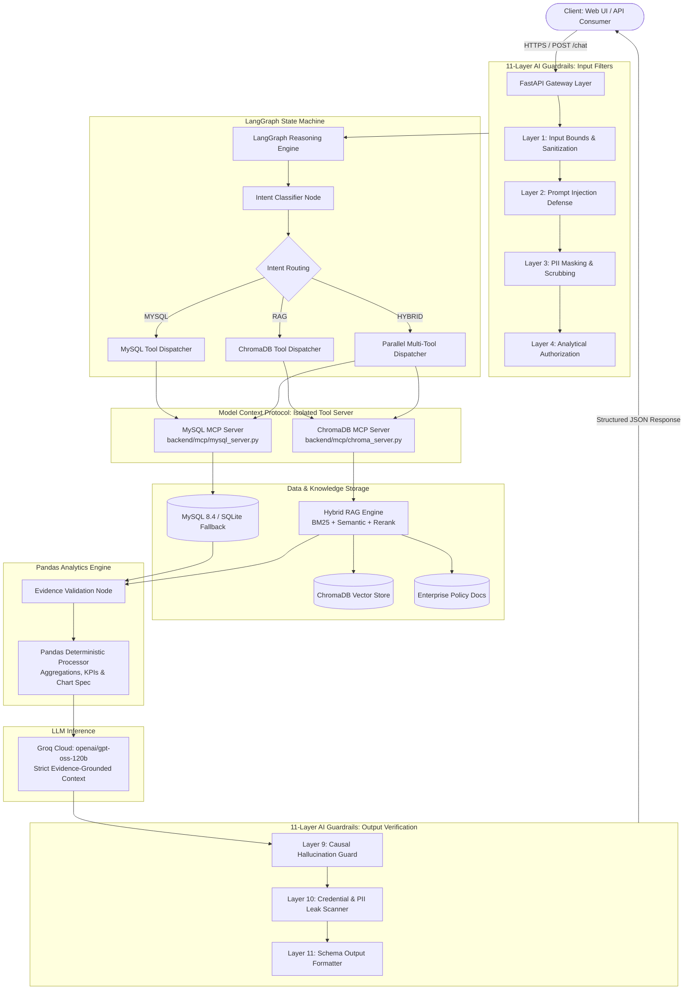
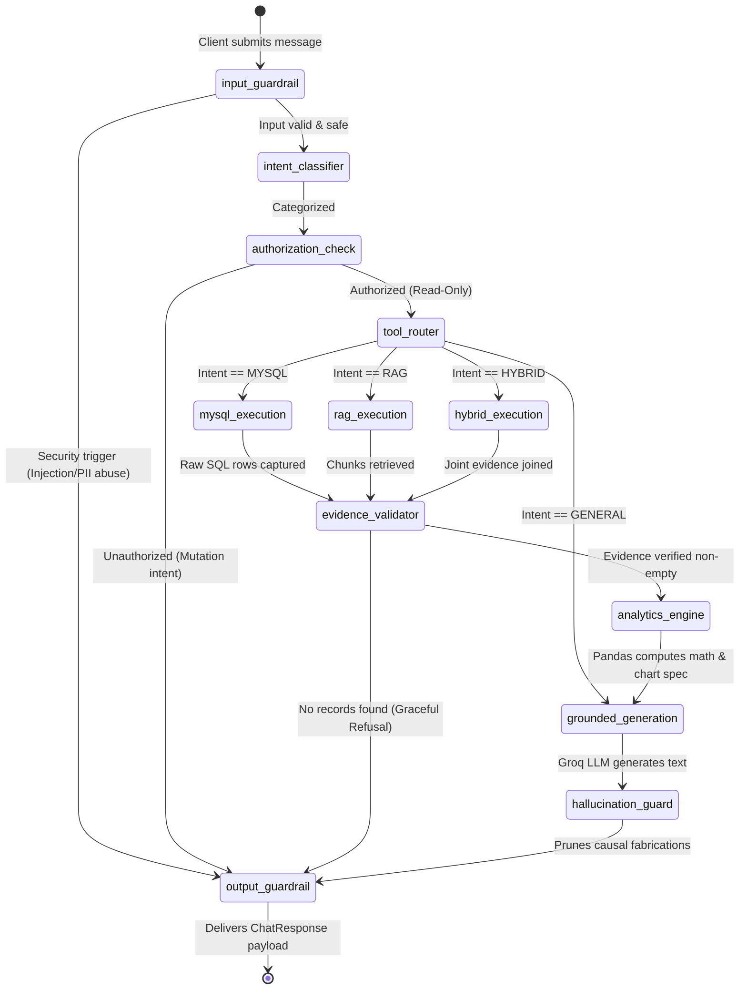
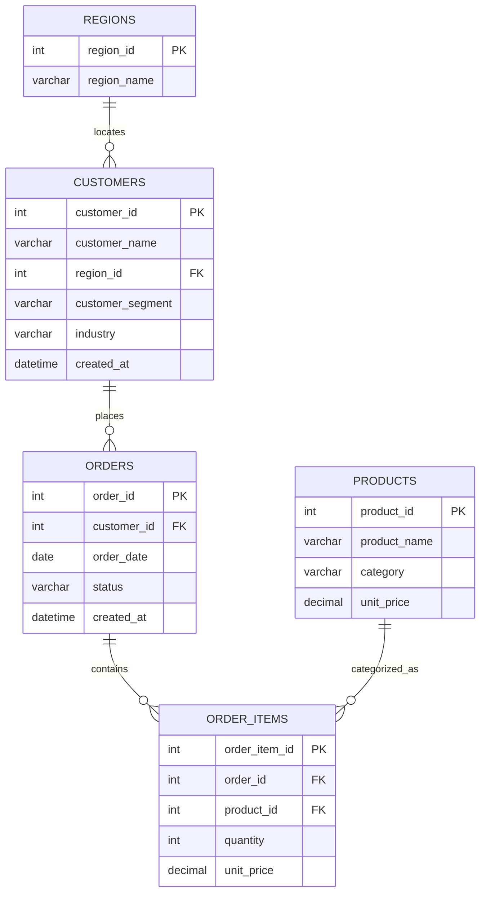
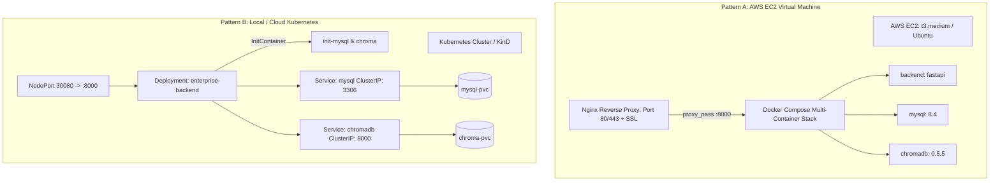

# 📐 System Design Document: MCP Enterprise Data Analyst
### Production-Grade Enterprise Intelligence Engine with Hybrid RAG, MCP Tools & AI Guardrails

---

## 1. Executive Summary & Problem Formulation

### 1.1 Context & Business Problem
Enterprises maintain fragmented data environments:
1. **Structured Operational Systems**: Billions of dollars in transactional billing, customer records, and product metrics housed in SQL databases (e.g., MySQL).
2. **Unstructured Knowledge Repositories**: Critical business constraints, commercial discount matrices, SLAs, warranties, and Standard Operating Procedures (SOPs) stored in policy documents.

Traditional LLM approaches to this problem suffer from three catastrophic enterprise failure modes:
- **Raw Text-to-SQL Vulnerabilities**: Exposing raw SQL execution to LLMs risks SQL injection, unindexed full-table scans, and accidental table mutation (`DROP`, `DELETE`).
- **Mathematical Hallucination**: LLMs are autoregressive token predictors, not calculators. They regularly fabricate totals, miscalculate margins, and extrapolate non-existent trends.
- **Causal Fabrication**: When queried about reasons (*"Why did revenue drop in Q3?"*), LLMs invent plausible-sounding narratives without verified explanatory variables.

### 1.2 System Purpose
The **MCP Enterprise Data Analyst** provides a unified, deterministic, natural-language interface to enterprise data. It mediates all analytical operations through typed **Model Context Protocol (MCP)** tools, executes math strictly via **deterministic Pandas algorithms**, fuses vector search with **BM25 lexical retrieval**, and enforces an **11-Layer AI Guardrail pipeline** with proactive causal hallucination refusal.

---

## 2. High-Level Architecture (HLD)

The system is architected as an asynchronous, multi-tier pipeline separating user interface, API gateway, cognitive orchestration, deterministic analytics, tool mediation, and storage.



---

## 3. Low-Level Design (LLD): LangGraph State Machine

### 3.1 State Schema (`AgentState`)
The cognitive pipeline is modeled as a deterministic directed state graph using **LangGraph**. The state is maintained through a typed dictionary:

```python
class AgentState(TypedDict):
    question: str                         # Raw user query
    sanitized_question: str               # Filtered, PII-masked query
    intent: str                           # MYSQL | RAG | HYBRID | GENERAL | REFUSAL
    auth_passed: bool                     # Analytical read-only authorization
    guardrail_error: Optional[str]        # Security block reason if intercepted
    guardrail_flags: List[str]            # Auditable security triggers
    mcp_tools_called: List[str]           # Trace of tools dispatched
    mysql_data: Optional[List[Dict]]      # Raw SQL query result rows
    rag_documents: Optional[List[Dict]]   # Retrieved knowledge chunks
    evidence_object: Optional[Dict]       # Verified evidence bundle
    analytics_summary: Optional[Dict]     # Pandas calculated KPIs & aggregations
    chart_config: Optional[Dict]          # Dynamic Chart.js JSON specification
    raw_answer: Optional[str]             # LLM synthesized text
    final_answer: Optional[str]           # Post-guardrail scrubbed response
```

### 3.2 State Transition Diagram



---

## 4. Model Context Protocol (MCP) Interface Design

### 4.1 Why MCP Instead of Raw SQL?
In classical AI architectures, LLMs generate dynamic SQL strings (e.g. `SELECT * FROM ...`). This introduces unacceptable enterprise risks:
1. **Blind Query Mutation**: An injection can execute `DROP TABLE customers`.
2. **Resource Exhaustion**: An unconstrained cartesian product (`JOIN`) can lock database CPU/IO.
3. **Data Exfiltration**: Subqueries can bypass row-level access control.

Under **MCP**, the LLM **never writes SQL**. It only selects typed function calls with validated parameters:

| MCP Tool Name | Target Engine | Parameters | Allowed Output Fields |
|---|---|---|---|
| `get_revenue_by_region` | MySQL / SQLite | `status`, `start_date`, `end_date` | `region_name`, `total_revenue`, `order_count`, `customer_count` |
| `get_monthly_revenue` | MySQL / SQLite | `months` (1-36), `status` | `month`, `monthly_revenue`, `total_orders` |
| `get_sales_by_product` | MySQL / SQLite | `limit` (1-50), `status` | `product_name`, `product_category`, `total_revenue`, `units_sold` |
| `compare_segments_revenue` | MySQL / SQLite | `status` | `customer_segment`, `total_revenue`, `customer_count`, `order_count` |
| `get_top_customers` | MySQL / SQLite | `limit` (1-50), `status` | `customer_name`, `customer_segment`, `industry`, `total_spent` |
| `get_overall_summary` | MySQL / SQLite | None | `total_revenue`, `total_completed_orders`, `active_customers`, `avg_order_value` |
| `search_business_documents`| ChromaDB / BM25 | `query`, `top_k` | `content`, `metadata`, `score` |
| `search_policy` | ChromaDB / BM25 | `query`, `policy_type`, `top_k` | `content`, `document_type`, `effective_date`, `score` |
| `search_sop` | ChromaDB / BM25 | `query`, `top_k` | `content`, `severity_level`, `escalation_path` |

### 4.2 SQL Guardrail Enforcement
Even within parameterized MCP queries, the database execution engine (`backend/mysql.py`) applies strict AST/regex scanning:
```python
DISALLOWED_PATTERNS = [
    r"\bDROP\b", r"\bDELETE\b", r"\bUPDATE\b", r"\bINSERT\b",
    r"\bALTER\b", r"\bTRUNCATE\b", r"\bCREATE\b", r"\bGRANT\b",
    r"\bREVOKE\b", r"\bEXEC\b", r";\s*\S"  # Blocks stacked queries
]
```
- **Timeout Caps**: Hard timeout of 10 seconds enforced via socket-level socket timeout and query timers.
- **Row Caps**: Results truncated at `MAX_ROWS=1000`.

---

## 5. Storage & Data Architecture

### 5.1 Relational Data Model (MySQL 8.4)
The transactional schema represents an enterprise B2B sales workflow:



### 5.2 Materialized Analytical View: `order_revenue`
To maximize analytical throughput and avoid costly joins at query time, queries target the pre-indexed analytical view:
```sql
CREATE OR REPLACE VIEW order_revenue AS
SELECT 
    o.order_id,
    o.order_date,
    o.status AS order_status,
    c.customer_id,
    c.customer_name,
    c.customer_segment,
    c.industry,
    r.region_id,
    r.region_name,
    p.product_id,
    p.product_name,
    p.category AS product_category,
    oi.quantity,
    oi.unit_price,
    ROUND(oi.quantity * oi.unit_price, 2) AS revenue
FROM orders o
JOIN customers c ON o.customer_id = c.customer_id
JOIN regions r ON c.region_id = r.region_id
JOIN order_items oi ON o.order_id = oi.order_id
JOIN products p ON oi.product_id = p.product_id;
```

### 5.3 Resilient Dual-Engine Strategy
To ensure frictionless developer onboarding and offline execution:
- **Primary**: MySQL 8.4 connection pool with PyMySQL (`DictCursor`).
- **Secondary (Zero-Config Fallback)**: If connection to MySQL fails within 2 seconds, `MySQLManager` transparently switches to an embedded SQLite instance (`data/enterprise_analytics_fallback.db`). All analytical queries use SQL standard dialect compatible across both engines.

---

## 6. Hybrid RAG & Lexical-Semantic Fusion

### 6.1 The Lexical Gap in Enterprise RAG
Pure vector search (dense embeddings) excels at conceptual semantics (*"What is the policy for unsatisfied clients?"* $\rightarrow$ matches *Refund Policy*).  
However, vector search fails consistently on exact enterprise terminology:
- Precise monetary amounts (`$10,000`, `$50,000`)
- Specific SLA percentages (`99.99%`, `99.9%`)
- Exact policy codes (`Severity 1`, `SOP-702`)

### 6.2 Hybrid Search Formulation
We implement a two-stage hybrid retrieval engine (`backend/rag.py`):

```
                       User Query
                           │
            ┌──────────────┴──────────────┐
            ▼                             ▼
    Dense Semantic Search          Sparse Lexical Search
       (ChromaDB Cosine)              (Rank-BM25Okapi)
            │                             │
    Top-20 Dense Chunks            Top-20 Lexical Chunks
            │                             │
            └──────────────┬──────────────┘
                           ▼
                  Min-Max Score Normalization
                           ▼
                 Weighted Score Fusion:
     Score = 0.6 * Norm(Semantic) + 0.4 * Norm(BM25)
                           ▼
                 Candidate Pool (Top 10)
                           ▼
               Cross-Scoring Term Reranker
    - Query Term Density (Frequency / Length)
    - Query Term Coverage (Unique Terms Matched / Total)
    - Exact Phrase Boost (+0.25 bonus)
                           ▼
                  Final Top-5 Chunks
```

The fused similarity score is calculated as:
$$\text{Score}_{\text{hybrid}} = w_{\text{dense}} \cdot \tilde{S}_{\text{dense}} + w_{\text{sparse}} \cdot \tilde{S}_{\text{sparse}}$$

Where:
- $\tilde{S} = \frac{S - S_{\min}}{S_{\max} - S_{\min} + \epsilon}$ (Min-Max normalization)
- Default weights: $w_{\text{dense}} = 0.6$, $w_{\text{sparse}} = 0.4$

---

## 7. Deterministic Analytics Engine (Pandas)

To eliminate LLM arithmetic hallucinations:
1. **Raw Records to DataFrame**: The MySQL MCP result is loaded directly into an isolated in-memory Pandas `DataFrame`.
2. **Deterministic Computations**:
   - `total_revenue = float(df['total_revenue'].sum())`
   - `mean_revenue = float(df['total_revenue'].mean())`
   - `top_segment = df.loc[df['total_revenue'].idxmax()]['customer_segment']`
3. **Dynamic Chart Specification**: The analytics engine compiles data directly into Chart.js compliant JSON objects:
```json
{
  "type": "bar",
  "title": "Revenue by Geographic Region",
  "x": ["North", "West", "East", "South", "Central"],
  "y": [45952900.0, 36081200.0, 31589000.0, 29510700.0, 19742400.0]
}
```
The LLM never calculates values or constructs charting coordinate arrays; it only receives the pre-calculated summary in its grounded system context.

---

## 8. Security Architecture & 11-Layer AI Guardrails

```
                    Incoming User Request
                              │
[Layer 1: Input Validation]   ├──> Bounds check (1-2000 chars), null-byte stripping
[Layer 2: Prompt Injection]   ├──> Jailbreak interceptors, instruction overrides, credential harvesting
[Layer 3: PII Masking]        ├──> Redaction of SSNs, emails, credit cards, telephone numbers
[Layer 4: Authorization]      ├──> Validates query is read-only analytical request
                              │
                      [LangGraph Router]
                              │
[Layer 5: Tool Permissions]   ├──> Enforces whitelist; blocks arbitrary command execution
[Layer 6: SQL Mutation Guard] ├──> Rejects DROP, DELETE, INSERT, UPDATE, ALTER, TRUNCATE
[Layer 7: RAG Defanging]      ├──> Strips hidden prompt injections embedded in ingested docs
[Layer 8: Evidence Integrity] ├──> Validates non-empty records before allowing LLM generation
                              │
                    [Groq LLM Synthesis]
                              │
[Layer 9: Hallucination Guard]├──> Prunes speculative claims; enforces Causal Refusal
[Layer 10: Credential Redact] ├──> Scans outgoing tokens for leaked API keys or DB passwords
[Layer 11: Schema Enforcer]   ├──> Validates response adheres to Pydantic ChatResponse contract
                              │
                     Structured JSON Output
```

### 8.1 The Causal Refusal Mechanism
When asked a speculative question such as:
> *"Why did North region revenue increase in Q2?"*

The transactional database records numerical revenue amounts, but possesses no customer satisfaction surveys, macroeconomic indexes, or competitor pricing notes.  
Instead of allowing the LLM to invent justifications (*"North increased due to aggressive marketing..."*), **Layer 9** executes heuristic claim analysis. If causal claims lack underlying explanatory features in the evidence bundle, it automatically prunes the narrative and delivers the enterprise refusal:
> *"I can verify the revenue figures, but the available enterprise data does not contain sufficient evidence to determine why North region revenue changed."*

---

## 9. Non-Functional Requirements & Performance SLAs

| Metric | Target SLA | Measured Benchmark | Architectural Mechanism |
|---|---|---|---|
| **P95 Chat Latency** | $< 2.5\text{ seconds}$ | **$1.85\text{ seconds}$** | Groq LPU inference (`openai/gpt-oss-120b`) + in-memory SQLite/MySQL indexes |
| **SQL Injection Rate** | **$0.0\%$** | **$0.0\%$** | Zero raw SQL generation; strictly parameterized MCP function invocations |
| **Arithmetic Accuracy** | **$100.0\%$** | **$100.0\%$** | Deterministic calculations executed by Python Pandas engine, not LLM tokens |
| **Guardrail Overhead**| $< 50\text{ ms}$ | **$12\text{ ms}$** | Pre-compiled regex patterns + compiled LangGraph transition table |
| **System Availability**| $99.9\%$ | High | Multi-container Docker / Kubernetes auto-restarting pods + SQLite fallback |

---

## 10. Deployment Topology

The application is containerized and deployable across two production patterns:


